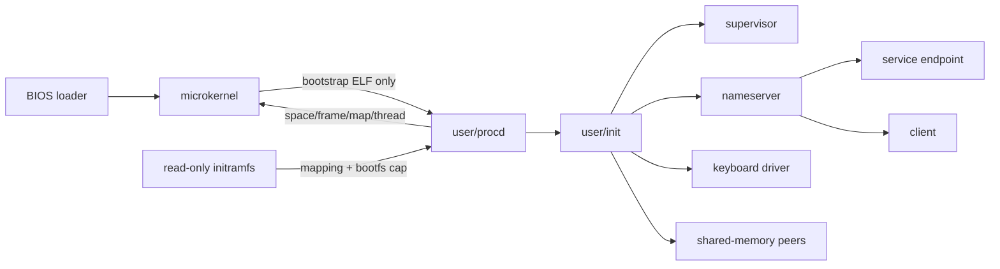

# Varania OS: учебное микроядро amd64

Varania OS — небольшая 64-битная capability-based ОС на Flat Assembler. Она
показывает полный путь от BIOS boot sector до изолированных ELF64-процессов,
причём обычные программы загружает не ядро, а пользовательский `procd`.

Проект остаётся учебным: активный код прокомментирован на русском, внутренние
процедуры следуют System V AMD64 ABI, а макросы FASM (`function`,
`leaf_function`, `system_call`, генераторы IDT) убирают повторения, не пряча
регистры, page tables и ownership объектов.

## Что работает

- переход `real mode → protected mode → long mode`, PAE и 4-level paging;
- ring 0/ring 3, TSS64, IST для double fault, IDT64, SYSCALL и NX;
- PMM по E820, slab allocator и полное разрушение user address space;
- kernel-объекты `AddressSpace`, `Frame`, `Endpoint`, `SharedMemory` и TCB;
- capability handles с проверкой типа/прав и refcount heap-объектов;
- endpoint IPC: очередь на 8 сообщений, 4 слова и до 2 capabilities в каждом;
- attenuation прав и атомарный `CAP_MOVE` после успешного enqueue;
- дерево происхождения capabilities и рекурсивный revoke всех descendants;
- low-level API `space/frame/map/thread`, не знающий имён и формата ELF;
- user-space `procd`: initramfs, проверка ELF64, BSS, W^X и запуск thread;
- user-space `nameserver`: регистрация и discovery endpoint-capabilities;
- динамические процессы, generation-safe token, `EXIT`/`WAIT` и внешний kill;
- user-space supervisor: restart policy остаётся вне привилегированного ядра;
- shared-memory objects до 16 страниц и передача доступа через endpoint IPC;
- многостраничные code/data, heap через `BRK`, stack growth через #PF;
- вытесняющий round-robin с квантом 10 мс;
- user-space PS/2 keyboard driver с правами только на IRQ1 и `0x60..0x64`;
- отдельные QEMU-тесты capabilities/IPC, изоляции памяти и lifecycle;
- воспроизводимая сборка на macOS Apple Silicon и Linux x86_64.

Успешный запуск печатает:

```text
procd: init started; process service ready
nameserver: service endpoint registered
VARANIA:IPC_QUEUE_OK
VARANIA:MEMORY_OK
VARANIA:ISOLATION_OK
VARANIA:LIFECYCLE_OK
VARANIA:REVOKE_OK
VARANIA:KILL_OK
VARANIA:SUPERVISOR_OK
VARANIA:SHM_OK
VARANIA:MICROKERNEL_OK
```

## Быстрый старт

### macOS Apple Silicon

Нужны QEMU и запущенный Docker Desktop:

```bash
brew install qemu
make test
make run
```

FASM из Homebrew не нужен. Зафиксированный FASM 1.73.35 запускается в локальном
`linux/amd64`-контейнере. Согласно [upstream change log](https://github.com/tgrysztar/fasm/blob/master/WHATSNEW.TXT),
эта версия выпущена 24 февраля 2026 года и содержит нативный 64-битный ELF
executable; репозиторий дополнительно проверяет SHA-256 архива.

### Linux x86_64 (Debian/Ubuntu)

```bash
sudo apt update
sudo apt install make python3 qemu-system-x86
make test
make run
```

На Linux официальный статический FASM запускается прямо из архива репозитория;
Docker не требуется.

## Команды

| Команда | Назначение |
|---|---|
| `make build` | boot, kernel, 15 user ELF, initramfs и raw image |
| `make check` | структура диска, initramfs и каждого ELF/PT_LOAD |
| `make smoke` | полный boot и IRQ1 через QMP |
| `make test-capabilities` | procd, nameserver, capability transfer и IPC queue |
| `make test-isolation` | code/data/heap/stack и supervisor HHDM isolation |
| `make test-lifecycle` | create/exit/wait/teardown и возврат frames |
| `make test-revoke` | дерево capability lineage и рекурсивный revoke |
| `make test-supervisor` | kill заблокированного процесса и два restart |
| `make test-shared` | две общие страницы, IPC transfer и teardown |
| `make test` | все статические и QEMU-тесты |
| `make run` | интерактивный QEMU |
| `make debug` | QEMU с `qemu-debug.log` |

Совместимая оболочка старого проекта: `./c.sh build|test|run`.

## Как загружается user space



Ядро знает только bootstrap-имя `procd.elf`. Procd получает read-only mapping
initramfs и capability на создание объектов. Все прочие ELF проверяет и
раскладывает по frames сам procd. Init общается с ним через endpoint, а сервисы
находят друг друга через отдельный nameserver. Имя файла никогда не становится
полномочием: доступ даёт только локальный capability handle.

## Активный код

```text
src/boot/boot.asm               BIOS, E820, paging и long-mode trampoline
src/kernel/amd64/objects.inc    AddressSpace/Frame/Endpoint и refcount
src/kernel/amd64/memory.inc     map/unmap/copy/teardown address spaces
src/kernel/amd64/task.inc       TCB, scheduler, lifecycle и capability table
src/kernel/amd64/ipc.inc        endpoint queues и capability transfer
src/kernel/amd64/device.inc     IRQ/I/O capabilities
src/kernel/amd64/syscall.inc    low-level user ABI
src/user/procd.asm              initramfs + ELF64 loader + process service
src/user/init.asm               запуск сервисов и интеграционный сценарий
src/user/supervisor.asm         внешний kill и restart policy
src/user/nameserver.asm         user-space service discovery
src/user/*.asm                  сервисы, драйвер и тестовые процессы
tests/                          structural и headless QEMU tests
```

Исторический 32-битный код сохранён для сравнения, но не входит в образ.

## Документация

- [Архитектура и ownership](docs/ARCHITECTURE.md)
- [ABI системных вызовов](docs/SYSCALLS.md)
- [User-space loader, initramfs и ELF64](docs/USERSPACE.md)
- [Драйверы в ring 3](docs/DRIVERS.md)
- [Сборка, тесты и отладка](docs/DEVELOPMENT.md)
- [История порта](docs/PORTING.md)

## Честные ограничения

- один CPU, legacy BIOS/PIC/PIT; нет UEFI, APIC, SMP и ACPI;
- один thread на process в текущем user API, максимум 16 TCB slots;
- initramfs фиксирован на 64 KiB; нет VFS, дискового сервера и сети;
- только статические `ET_EXEC`; нет PIE, relocations и dynamic linker;
- stack ограничен 16 страницами, heap — 256 страницами;
- IPC control payload мал и копируется; для bulk data есть shared memory, но
  пока без частичного unmap и resize;
- нет fork, signals и POSIX runtime; restart policy пока демонстрационная;
- IRQ/I/O покрывают PS/2; для MMIO/DMA нужны Frame/IRQ policy и IOMMU;
- нет ASLR, SMEP/SMAP, SMP-locking и transfer между несколькими CPU;
- cyclic endpoint capabilities могут образовать логический цикл владения.

Эти ограничения задокументированы как границы следующего этапа, а не скрыты
за интерфейсом, похожим на production-ОС.
