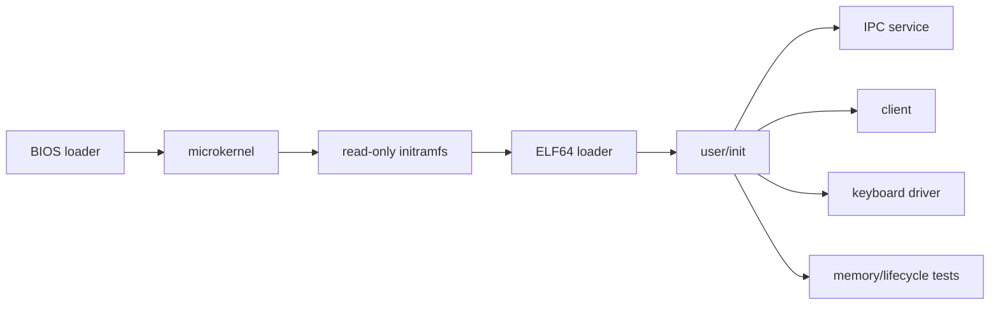

# Varania OS: учебное микроядро amd64

Varania OS — небольшая 64-битная операционная система на Flat Assembler. Она
показывает полный путь от BIOS boot sector до изолированных ELF64-процессов,
которые создаёт пользовательский `init`. Проект начинался в 2019 году как
монолитное 32-битное ядро; активная версия — однопроцессорное capability-based
микроядро amd64.

Главная цель — читаемость. Активный код подробно прокомментирован на русском,
функции следуют System V AMD64 ABI, а небольшие макросы FASM убирают рутинные
прологи и генерацию однотипных таблиц, не скрывая работу CPU и page tables.

## Что уже работает

- BIOS loader: `real mode → protected mode → long mode`;
- PAE, четырёхуровневый paging, CR0.WP, EFER.NXE и supervisor-only HHDM;
- GDT ring 0/ring 3, TSS64, IST1 для double fault и IDT64;
- PMM по BIOS E820, slab allocator и полное освобождение process frames;
- initramfs с детерминированной таблицей файлов;
- строгий загрузчик `ELF64 ET_EXEC`: `PT_LOAD`, BSS, W^X, RX/RW/NX;
- до 16 динамических процессов с generation-safe process capabilities;
- многостраничные code/data, heap через `SYS_BRK` и растущий user stack;
- вытесняющий round-robin с квантом 10 ms и общий `Context` для IRQ/SYSCALL;
- `SYS_SPAWN`, передача/ослабление capabilities, `SYS_WAIT` и exit status;
- IPC-очередь из восьми сообщений и прямая доставка спящему получателю;
- локализация user faults: неисправный процесс завершается, ядро продолжает;
- ring-3 PS/2 keyboard driver с capabilities только на IRQ1 и `0x60..0x64`;
- отдельные QEMU-тесты memory isolation и полного process lifecycle;
- воспроизводимая сборка на macOS Apple Silicon и Linux x86_64.

Успешный интеграционный запуск заканчивается маркерами:

```text
VARANIA:IPC_QUEUE_OK
VARANIA:MEMORY_OK
VARANIA:ISOLATION_OK
VARANIA:LIFECYCLE_OK
VARANIA:MICROKERNEL_OK
```

## Быстрый старт

### macOS Apple Silicon (M1/M2/M3/M4)

Нужны QEMU и запущенный Docker Desktop:

```bash
brew install qemu
make test
make run
```

FASM из Homebrew не нужен. Зафиксированный FASM 1.73.35 выполняется в локальном
`linux/amd64`-контейнере; сборка ничего не устанавливает в систему.

### Linux x86_64 (Debian/Ubuntu)

```bash
sudo apt update
sudo apt install make python3 qemu-system-x86
make test
make run
```

На Linux официальный статический FASM запускается прямо из архива репозитория,
Docker не требуется.

## Команды

| Команда | Назначение |
|---|---|
| `make build` | собрать boot, kernel, user ELF, initramfs и raw image |
| `make check` | проверить образ, initramfs и каждый ELF/PT_LOAD |
| `make smoke` | проверить полный сценарий и IRQ1 через QMP |
| `make test-isolation` | отдельно проверить code/data/heap/stack и HHDM isolation |
| `make test-lifecycle` | отдельно проверить create/exit/wait/teardown/slot reuse |
| `make test` | выполнить все статические и QEMU-тесты |
| `make run` | открыть VGA-окно QEMU |
| `make debug` | записать CPU/interrupt log в `qemu-debug.log` |
| `make clean` | удалить только результаты сборки |

Совместимая оболочка старого проекта сохранена: `./c.sh build|test|run`.

## Как запускается user space



Ядро bootstrap-ит только `init.elf` и выдаёт ему system, IRQ1 и I/O-port
capabilities. Все остальные программы запускает сам `init` через `SYS_SPAWN`.
Клиент получает endpoint сервиса, а keyboard driver — IRQ и I/O range. Имена
процессов не являются полномочиями: после создания взаимодействие идёт только
через локальные capability handles.

## Дерево активного кода

```text
src/boot/boot.asm               BIOS, E820, paging, long mode, initramfs copy
src/const.inc                   физическая и виртуальная карта памяти
src/kernel/kernel.asm           композиция и bootstrap user/init
src/kernel/amd64/initramfs.inc  проверка архива и поиск файла
src/kernel/amd64/elf.inc        ELF64/PT_LOAD/BSS/W^X loader
src/kernel/amd64/memory.inc     address spaces, map/unmap/teardown
src/kernel/amd64/task.inc       process lifecycle, scheduler, capabilities
src/kernel/amd64/ipc.inc        кольцевые очереди IPC
src/kernel/amd64/device.inc     IRQ/I/O capabilities
src/kernel/amd64/syscall.inc    user ABI и безопасное копирование
src/user/init.asm               пользовательский process manager/bootstrap
src/user/*.asm                  сервисы, драйвер и тестовые процессы
scripts/mkinitramfs.py          детерминированная упаковка user ELF
tests/                          structural и headless QEMU tests
tools/fasm/                     воспроизводимый FASM 1.73.35
```

Исторический 32-битный код оставлен в `src/kernel/` для сравнения, но не входит
в активный образ.

## Документация

- [Архитектура и доверенная граница](docs/ARCHITECTURE.md)
- [User space, initramfs и ELF64](docs/USERSPACE.md)
- [ABI системных вызовов](docs/SYSCALLS.md)
- [Драйверы в пользовательском пространстве](docs/DRIVERS.md)
- [Сборка, тестирование и отладка](docs/DEVELOPMENT.md)
- [История переноса x86 → amd64 → микроядро](docs/PORTING.md)

## Честные ограничения

Это рабочее учебное микроядро, но не production-ОС:

- один CPU, legacy BIOS/PIC/PIT; пока нет UEFI, APIC, SMP и ACPI;
- максимум 16 process slots, initramfs фиксирован на 64 KiB;
- ELF loader поддерживает статические `ET_EXEC`, но не PIE, relocations и dynamic linking;
- user stack ограничен 16 страницами, heap — 256 страницами на процесс;
- IPC переносит два машинных слова метаданных, но пока не shared memory/large payload;
- нет VFS, постоянного хранилища, сети, POSIX и системного C ABI/runtime;
- IRQ/I/O показаны на PS/2; для MMIO/DMA нужны новые объекты и IOMMU;
- slab повторно использует объекты, но ещё не возвращает полностью пустые slab pages PMM;
- нет SMP-locking, ASLR, SMEP/SMAP и полноценного отзыва всех копий capability.

Ограничения перечислены явно: следующие этапы можно добавлять поверх уже
проверяемых механизмов, не маскируя учебную реализацию под готовую систему.
