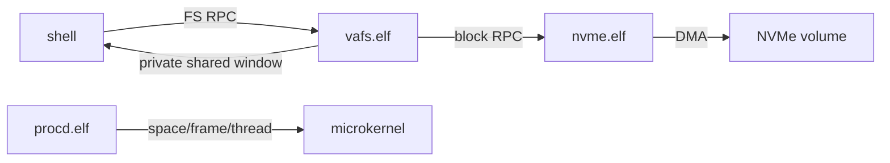

# Varania OS — современная учебная микроядерная ОС amd64

Varania OS показывает устройство 64-битной capability-based ОС без слоя
«магии». Учебность здесь означает понятный FASM, небольшие процедуры,
проверяемые инварианты и подробные русские комментарии. Она не означает
ориентацию на 32-битные CPU, CD-ROM и диски в несколько мегабайт.

Целевая машина — x86-64 с UEFI, ACPI/APIC, PCIe/NVMe, GOP, USB HID,
несколькими CPU и как минимум 128 MiB RAM. Переход к этому профилю идёт
поэтапно: рабочий BIOS/VGA/PS2 путь пока оставлен как compatibility bootstrap,
но постоянный системный том уже обслуживает настоящий ring-3 NVMe-драйвер.

## Что уже работает

- long mode, четырёхуровневые page tables, NX, ring 0/ring 3, TSS64 и SYSCALL;
- PMM по E820, slab allocator, растущий user stack и `brk` heap до 16 MiB;
- разделённые `AddressSpace`, `Frame`, `Endpoint`, `SharedMemory`, process/TCB;
- capability attenuation, move, дерево происхождения и recursive revoke;
- IPC-очередь на восемь сообщений: 8 qword и до 2 capabilities в сообщении;
- динамические ELF64-процессы, `exit/wait`, внешний kill и supervisor restart;
- освобождение page tables, физических frames, shared mappings и capabilities;
- PCI configuration через ограниченную I/O capability;
- изолированный NVMe-драйвер в ring 3: BAR, admin/I/O queues, DMA, Identify,
  Read, Write и Flush;
- собственная VaraniaFS: 4-KiB блоки, 64-битные адреса, extents, COW B+tree,
  CRC32C, две generation-копии superblock и постоянные изменения;
- отдельный ring-3 VFS server и приватные 256-KiB shared file windows;
- shell: `ls`, `cd`, `mkdir`, `touch`, `cat`, `write`, `pwd`, `clear`, `help`;
- host-утилита VaraniaFS для macOS/Linux: format/import/get/put/rm/fsck;
- тесты изоляции памяти, lifecycle, IPC, revoke, supervisor, shared memory,
  NVMe DMA и сохранности файлов после остановки VM.

Ядро не знает ни ELF-путей, ни каталогов, ни NVMe-команд. Путь данных выглядит
так:



## Быстрый старт

### macOS Apple Silicon

Нужны QEMU и запущенный Docker Desktop:

```bash
brew install qemu
make test
make run
```

Официальный FASM 1.73.35 запускается в локальном `linux/amd64` контейнере.
Архив закреплён в репозитории и проверяется по SHA-256. Окно QEMU открывается
масштабированным; `VARANIA_QEMU_FULLSCREEN=0 make run` оставляет обычное окно.

### Linux x86_64

```bash
sudo apt update
sudo apt install make python3 qemu-system-x86
make test
make run
```

На Linux официальный бинарник FASM запускается непосредственно, Docker не нужен.

## Интерактивная система

После self-tests появляется терминал:

```text
Welcome to Varania OS
User-space terminal, NVMe and VaraniaFS are ready.

varania:/$ ls
system/
varania:/$ mkdir demo
varania:/$ cd demo
varania:/demo$ touch note
varania:/demo$ write note hello
varania:/demo$ cat note
hello
```

В формате намеренно нет UID/GID/mode/ACL и аналога `sudo`. Доступ задаётся
endpoint capability процесса, а не POSIX-моделью прав.

## Образы и обмен файлами

Сборка создаёт два sparse-образа логическим размером 1 GiB:

- `VOS.VHD` — временный compatibility boot disk; VaraniaFS начинается с 4 MiB;
- `VARANIA.VAFS` — системный том, подключаемый к QEMU как PCIe NVMe namespace.

Они занимают на host только реально записанные блоки. Примеры обмена:

```bash
python3 tools/vafs/vafs.py tree VARANIA.VAFS /
python3 tools/vafs/vafs.py put VARANIA.VAFS hello.asm /hello.asm
python3 tools/vafs/vafs.py get VARANIA.VAFS /demo/note ./note.txt
python3 tools/vafs/vafs.py fsck VARANIA.VAFS --data
```

Нельзя изменять тот же image host-утилитой одновременно с запущенной VM.

## Основные команды

| Команда | Что проверяет или запускает |
|---|---|
| `make build` | kernel, 19 ELF64, initramfs и оба sparse-диска |
| `make check` | boot layout, ELF W^X, FASM hash и VaraniaFS fsck |
| `make smoke` | boot, процессы, IPC, IRQ1 и NVMe DMA read/write/flush |
| `make test-shell` | keyboard → terminal → VFS → NVMe и remount/fsck |
| `make test-vafs` | COW, CRC32C, B+tree, torn-super recovery и raw offset |
| `make test` | все structural и QEMU-тесты |
| `make run` | интерактивная VM |
| `make debug` | VM с `qemu-debug.log` |

Также доступны отдельные `test-capabilities`, `test-isolation`,
`test-lifecycle`, `test-revoke`, `test-supervisor` и `test-shared`.

## Карта исходников

```text
src/boot/boot.asm               compatibility BIOS bootstrap
src/kernel/amd64/               memory, objects, IPC, scheduler, syscalls
src/user/procd.asm              строгий ELF64 loader и process service
src/user/nvme.asm               PCIe/NVMe ring-3 block driver
src/user/vafs.asm               persistent COW filesystem server
src/user/terminal.asm           VGA terminal и line discipline
src/user/keyboard.asm           PS/2 compatibility input driver
src/user/shell.asm              файловая командная оболочка
tools/vafs/vafs.py              macOS/Linux VaraniaFS CLI
tests/                          structural, recovery и QEMU end-to-end tests
```

## Документация

- [Целевая современная платформа](docs/PLATFORM.md)
- [Архитектура и ownership](docs/ARCHITECTURE.md)
- [VaraniaFS on-disk format](docs/VAFS.md)
- [VFS/block IPC и shell](docs/FILESYSTEM.md)
- [ABI системных вызовов](docs/SYSCALLS.md)
- [User-space ELF loader](docs/USERSPACE.md)
- [Сборка и тесты](docs/DEVELOPMENT.md)
- [Драйверы в ring 3](docs/DRIVERS.md)

## Честная граница текущего этапа

- firmware bootstrap ещё BIOS, а не UEFI/GPT; QEMU machine пока `pc`, не `q35`;
- scheduler однопроцессорный PIC/PIT; ACPI, APIC, SMP-locking ещё впереди;
- terminal использует VGA text mode, keyboard — PS/2 set 1; GOP/USB HID не готовы;
- VaraniaFS v1 использует append allocator без segment cleaner/discard;
- runtime loader пока берёт bootstrap ELF из initramfs, а не по пути VaraniaFS;
- FASM 1.73.35 source уже лежит на системном томе, но Varania platform layer и
  полностью self-hosted сборка ещё не завершены;
- только статические ELF64 `ET_EXEC`, без PIE/dynamic linker;
- один user thread на процесс, максимум 16 активных TCB.

Эти пункты — следующий план работ, а не скрытые обещания готовой production-ОС.
