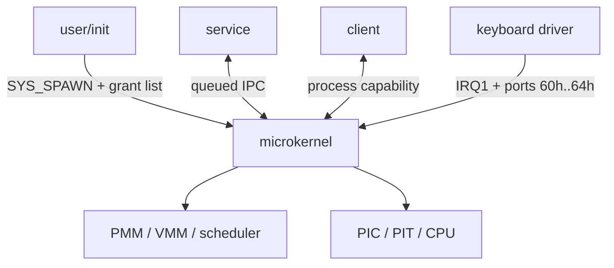
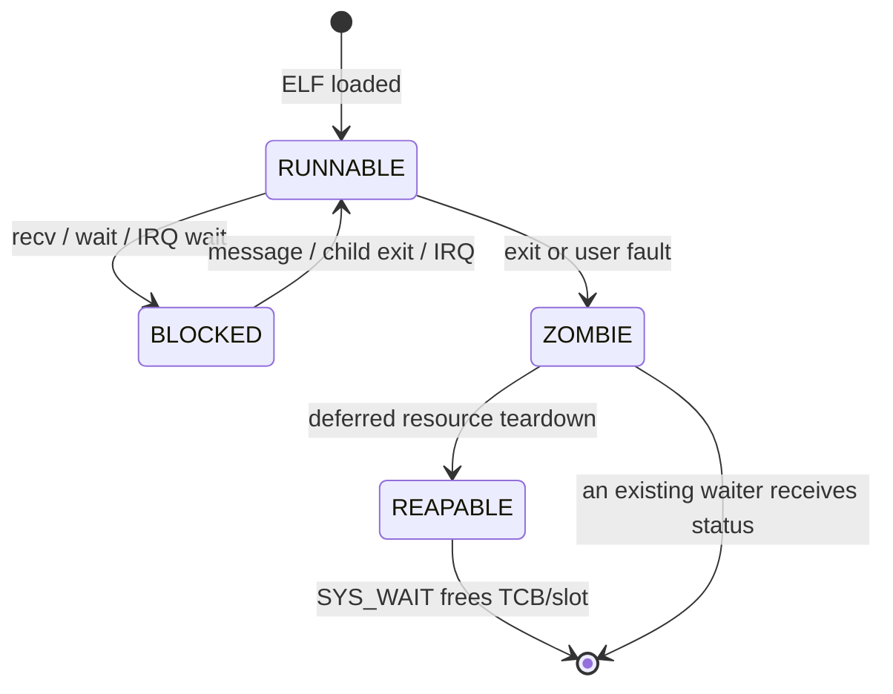

# Архитектура Varania OS

## Доверенная граница

В ring 0 остаются механизмы, которым действительно нужны привилегии:

- исключения, IRQ, PIC/PIT и вход `SYSCALL`;
- PMM/VMM, создание и разрушение address spaces;
- переключение контекста и планирование;
- проверка capabilities, IPC и копирование через user/kernel boundary;
- проверка initramfs/ELF и минимальный ранний debug output.

Политика запуска вынесена в ring 3: `init` выбирает программы, создаёт сервисы,
передаёт им capabilities и ждёт их завершения. Драйвер клавиатуры также не
входит в ядро.



## Загрузка

1. BIOS помещает LBA 0 в `0x7C00`.
2. Первый этап читает 4-KiB продолжение в `0x1000`.
3. Real-mode этап включает A20, читает kernel и initramfs во временные DMA
   buffers ниже 1 MiB и получает карту E820.
4. Protected-mode этап строит bootstrap PML4, копирует kernel в `0x100000`,
   initramfs в `0x400000`, GDT/TSS — в зарезервированные страницы.
5. `CR4.PAE`, `EFER.LME`, `CR0.PG|WP` включаются в архитектурном порядке.
6. 64-битный trampoline переходит на `0xFFFF800000100000`.
7. Ядро включает NXE, проверяет initramfs, загружает `init.elf` и выходит в
   ring 3 через искусственный `Context` и `IRETQ`.
8. User `init` запускает сервисы, драйвер и тестовые процессы через ABI.

## Raw disk layout

`VOS.VHD` — raw image; расширение сохранено исторически.

| LBA | Размер | Содержимое | Временный/постоянный адрес |
|---:|---:|---|---|
| 0 | 512 Б | MBR и `55 AA` | `0x7C00` |
| 1–8 | 4096 Б | второй этап | `0x1000` |
| 9–136 | 65536 Б | микроядро | `0x60000` → `0x100000` |
| 137–264 | 65536 Б | initramfs | `0x70000` → `0x400000` |

## Физическая и виртуальная память

Bootstrap резервирует:

| Диапазон | Назначение |
|---|---|
| `0x000600..0x0009FF` | BIOS E820 |
| `0x001000..0x001FFF` | stage 2 и trampoline |
| `0x010000..0x014FFF` | bootstrap page tables |
| `0x060000..0x07FFFF` | временные kernel/initramfs buffers |
| `0x100000..0x10FFFF` | kernel image |
| `0x2DF000` | GDT64/TSS64 |
| `0x2E0000..0x2FFFFF` | IST1 и bootstrap kernel stack |
| `0x3F0000..0x3F7FFF` | PMM bitmap |
| `0x400000..0x40FFFF` | read-only initramfs storage |
| `0x500000..` | кадры, выдаваемые PMM |

Bootstrap PML4 отображает identity и HHDM большими 2-MiB pages. Процесс получает
новый PML4 с пустой нижней половиной и общей записью `PML4[256]`:

```text
PML4[0]   -> identity 0..1 GiB          только bootstrap CR3
PML4[256] -> HHDM + physical address    общий, supervisor-only
```

`HHDM.base = 0xFFFF800000000000`. U/S не установлен ни на одном HHDM-уровне,
поэтому ring 3 не может читать ядро даже при наличии этой ветви в CR3. User
pages используют 4-KiB mappings; executable segments — RX, writable — RW+NX.

## ELF address space

- ELF images: `0x00010000..0x3FFFFFFF`;
- heap начинается с выровненного конца последнего `PT_LOAD`;
- heap ограничен 256 pages;
- stack top: `0x00007FFFFFF00000`;
- изначально отображена одна RW+NX page;
- #PF может добавить только непосредственно соседнюю нижнюю page;
- максимум stack — 16 pages.

`SYS_BRK` отображает/снимает целые страницы, а точное значение break хранится в
TCB. Каждый новый кадр обнуляется до user mapping.

## Process lifecycle

TCB выделяется из slab; глобальная таблица содержит 16 указателей. Process
token объединяет slot и generation, поэтому capability старого процесса не
начнёт указывать на новый процесс после reuse.



Текущий process нельзя разрушить на его собственном CR3 и kernel stack.
Поэтому exit сначала создаёт zombie и будит waiter; следующая безопасная задача
освобождает user frames, все нижние page tables, PML4 и kernel-stack frame.
После `SYS_WAIT` освобождается TCB и slot становится доступен новому generation.

## Context и scheduler

IRQ и SYSCALL используют один `Context` размером 160 байт:

```text
r15..r8, rdi, rsi, rbp, rdx, rcx, rbx, rax,
RIP, CS, RFLAGS, user RSP, user SS
```

PIT/IRQ0 сохраняет kernel RSP в TCB, выбирает следующий `RUNNABLE`, меняет CR3
и TSS.RSP0 и восстанавливает другой Context через `IRETQ`. Политика — простой
round-robin, квант 10 ms. Если все процессы заблокированы, ядро выполняет
`STI; HLT` и просыпается по IRQ.

## Capabilities

Handle локален процессу; ноль всегда недействителен. В каждом из 16 slots лежат
`type`, `object`, `rights`.

| Тип | Object | Права |
|---|---|---|
| process | generation-safe token | `SEND`, `WAIT` |
| I/O ports | `length:32 | base:16` | `READ`, `WRITE` |
| IRQ | `irq+1` | `WAIT` |
| system | kernel object | `SPAWN` |

`SYS_SPAWN` принимает до четырёх `{handle, rights}`. Права ребёнка обязаны быть
подмножеством прав родителя. Process/I/O capabilities копируются; уникальная
IRQ capability после успешного spawn атомарно перемещается ребёнку.

## IPC

`SYS_SEND` принимает process capability с `CAP_SEND`, а не PID/token. У каждого
получателя кольцевая очередь на восемь `{sender_token, value}`. Если получатель
уже заблокирован в `SYS_RECV`, ядро записывает результат прямо в его сохранённый
Context. Полная очередь возвращает `-11`, реализуя явный backpressure.

Sender token в `RDX` — только идентификатор события, не полномочие. Для ответа
процесс должен заранее получить отдельную capability.

## Исключения и teardown

32 stubs генерируются `exception_stub`; наличие CPU error code нормализуется.
Ring-0 fault печатает vector/error/RIP и останавливает CPU. Ring-3 fault даёт
exit status `128+vector`. Исключение #PF сначала проверяется как допустимый рост
стека; остальные page faults завершают только виновный процесс.
