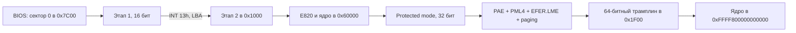

# Архитектура Varania OS amd64

## Путь от BIOS до ядра



`src/boot/boot.asm` собирается в 4608 байт:

1. Первый сектор (512 байт) BIOS помещает в `0x7C00`. Он сохраняет номер
   загрузочного диска и по одному сектору читает продолжение через BIOS EDD.
2. Второй этап (8 секторов, 4096 байт) находится в `0x1000`. Пока доступны
   BIOS-прерывания, он открывает A20, читает 128 секторов ядра во временный
   буфер `0x60000` и получает карту памяти E820.
3. После загрузки GDT устанавливается `CR0.PE` и выполняется дальний переход в
   32-битный код.
4. 32-битный этап строит таблицы, копирует ядро в физический `0x100000`,
   устанавливает `CR4.PAE`, `IA32_EFER.LME`, `CR0.PG|WP` и делает дальний
   переход в 64-битный сегмент.
5. Трамплин загружает 64-битные сегменты, TSS, стек и переходит по верхнему
   виртуальному адресу ядра.

Порядок PAE → LME → paging принципиален. Изменять его без сверки с руководством
AMD/Intel нельзя: процессор уйдёт в тройной сбой ещё до первой инструкции ядра.

## Формат диска

Образ `VOS.VHD` имеет raw-формат; расширение историческое и не означает
Microsoft VHD с заголовком.

| LBA | Размер | Содержимое | Адрес загрузки |
|---:|---:|---|---:|
| 0 | 512 Б | первый этап и `55 AA` | `0x7C00` |
| 1–8 | 4096 Б | второй этап | `0x1000` |
| 9–136 | 65536 Б | 64-битное ядро | `0x60000`, затем `0x100000` |

`src/link.asm` намеренно лишь объединяет `BOOT.BIN` и `KERNEL.BIN`. Тест
`tests/check_image.py` проверяет это побайтно.

## Физическая карта памяти до запуска PMM

| Физический диапазон | Назначение |
|---|---|
| `0x000600..0x0009FF` | число и записи BIOS E820 |
| `0x001000..0x001FFF` | второй этап загрузчика |
| `0x002000..0x00FFFF` | стек 32-битного этапа |
| `0x010000..0x016FFF` | начальные PML4/PDPT/PD/PT |
| `0x01A000..0x029FFF` | пул из 16 новых таблиц страниц |
| `0x060000..0x06FFFF` | временная копия ядра |
| `0x100000..0x10FFFF` | физическая копия ядра |
| `0x120000..0x2DEFFF` | линейная куча ядра |
| `0x2DF000` | GDT64 и TSS64 |
| `0x2E0000..0x2EFFFF` | аварийный IST-стек |
| `0x2F0000..0x2FFFFF` | стек ядра |
| `0x3F0000..0x3F7FFF` | битовая карта PMM |

Все значения определены один раз в `src/const.inc`. Если меняется диапазон,
следует одновременно проверить загрузчик, PMM и документацию.

## Виртуальная память

Начальная PML4 содержит два независимых отображения:

```text
PML4[0]
  └─ PDPT_ID[0]
       └─ PD_ID[0..3]       четыре большие страницы: 0..8 MiB identity

PML4[256]
  └─ PDPT_HI[0]
       └─ PD_HI[0..1]
            ├─ PT_HI0       0xFFFF800000000000 -> физ. 0x100000
            └─ PT_HI1       следующие 2 MiB     -> физ. 0x300000
```

Верхнее отображение использует 4-КиБ PTE. Причина важна: физический адрес
ядра `0x100000` не выровнен на 2 MiB, поэтому его нельзя поместить в PDE с
флагом `PS`. Попытка сделать это создаёт зарезервированную запись и #PF.

`vmm_map_page` создаёт недостающие уровни из пула `PT.FREE`. Демонстрационная
программа получает адрес `0xFFFF900000000000`, то есть отдельную ветвь PML4.

## Внутренний ABI

Активные amd64-модули используют соглашение System V AMD64:

| Назначение | Регистры |
|---|---|
| Аргументы 1–6 | `RDI`, `RSI`, `RDX`, `RCX`, `R8`, `R9` |
| Результат | `RAX` |
| Сохраняет функция | `RBX`, `RBP`, `R12..R15` |
| Временно использует вызывающий код | остальные GPR |

Это заменило нестандартные 32-битные макросы `proc/stdcall`. Явные регистры
лучше показывают реальный ABI и упрощают будущую связь с C/Rust.

## Прерывания

IDT содержит 256 записей по 16 байт и занимает последние 4096 байт ядра.

- векторы `0..31` — исключения CPU;
- `0x20` — PIT/IRQ0;
- `0x21` — клавиатура/IRQ1;
- `0x30` — учебный системный вызов печати строки из `RSI`.

Stub исключения приводит кадр к единой форме:

```text
vector, error, RIP, CS, RFLAGS [, RSP, SS]
```

Для исключений без аппаратного кода ошибки добавляется ноль. Затем сохраняются
15 регистров общего назначения. Двойной сбой использует `IST1`, поэтому
диагностика возможна даже при повреждённом обычном стеке.

## Физическая память

PMM начинает с карты, полностью помеченной как занятой. Он освобождает только
полные 4-КиБ кадры в E820-областях типа `usable`, затем снова резервирует кучу,
GDT/TSS, оба стека и собственную карту. Один бит соответствует одному кадру;
32-КиБ карта описывает до 1 GiB физической памяти.

Куча — линейный bump allocator с выравниванием 16 байт. Освобождения пока нет:
это сознательное ограничение, а не скрытая утечка.
