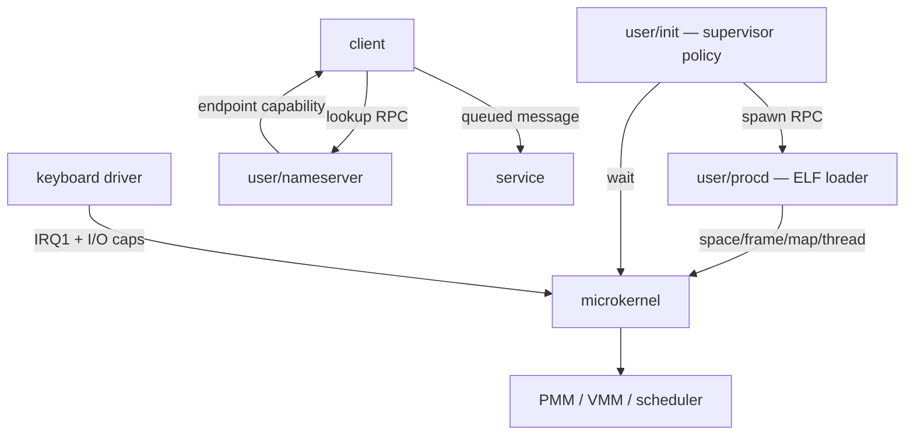
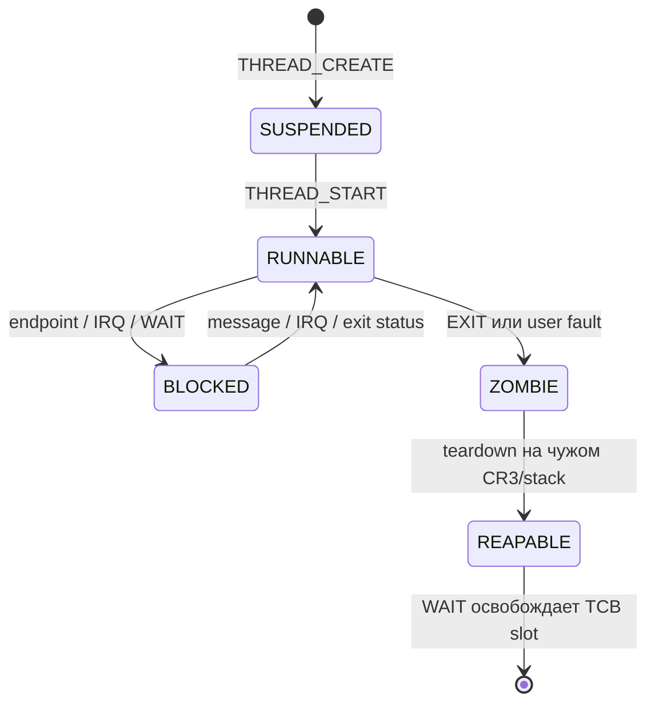

# Архитектура Varania OS

## Граница микроядра

Ring 0 содержит механизмы, которым нужны привилегии:

- exceptions/IRQ, PIC/PIT, SYSCALL и переключение контекста;
- физические frames, page tables и безопасное копирование user memory;
- TCB scheduler и lifecycle;
- kernel objects, capability tables, refcount и endpoint queues;
- минимальные IRQ/I/O операции после проверки capability;
- bootstrap-проверку архива и загрузку единственного `procd.elf`.

Ring 0 не принимает имя обычной программы и не разбирает её ELF при создании.
Эта политика находится в `user/procd`: он читает read-only bootfs, проверяет
ELF, создаёт space/frames/mappings/thread. `init` решает, какие процессы нужны,
а `nameserver` связывает клиентов и сервисы capability handles.



Bootstrap ELF loader всё ещё находится в kernel, потому что до первого user
процесса некому выполнить `procd`; это единственное исключение границы.
Номер старого `SYS_SPAWN` зарезервирован для совместимости ABI и возвращает
`-38`: generic kernel spawn удалён.

## Загрузка

1. BIOS загружает MBR в `0x7C00`, затем stage 2 в `0x1000`.
2. Real mode включает A20, читает kernel/initramfs ниже 1 MiB и получает E820.
3. Protected mode строит bootstrap tables, переносит kernel в `0x100000`,
   initramfs в `0x400000`, готовит GDT/TSS.
4. CPU включает `CR4.PAE`, `EFER.LME`, `CR0.PG|WP` и прыгает в higher half.
5. Kernel включает NXE, PMM/slab/IDT/SYSCALL, проверяет initramfs и bootstrap-ит
   `procd.elf` через искусственный `Context`/`IRETQ`.
6. Initramfs отображается procd по `0x80000000` как user read-only + NX;
   `BOOTFS_INFO` раскрывает только base/used size владельцу bootfs capability.
7. Procd загружает `init.elf`; дальше init создаёт систему RPC-запросами.

## Raw disk layout

`VOS.VHD` — raw image; расширение сохранено исторически.

| LBA | Размер | Содержимое | Временный → постоянный адрес |
|---:|---:|---|---|
| 0 | 512 Б | MBR и `55 AA` | `0x7C00` |
| 1–8 | 4096 Б | stage 2 | `0x1000` |
| 9–136 | 65536 Б | microkernel | `0x60000 → 0x100000` |
| 137–264 | 65536 Б | initramfs | `0x70000 → 0x400000` |

PMM освобождает только E820 usable pages начиная с `0x500000`, поэтому kernel,
initramfs, GDT/TSS, stacks и bitmap не могут случайно попасть в allocator.

## Виртуальная память

Bootstrap PML4 имеет identity map и supervisor-only HHDM. AddressSpace процесса
получает пустую нижнюю половину и общую запись `PML4[256]`:

```text
PML4[0]   -> identity 0..1 GiB       только bootstrap CR3
PML4[256] -> HHDM + physical         общий, supervisor-only
```

`HHDM.base = 0xFFFF800000000000`. U/S отсутствует на каждом уровне HHDM, что
проверяет `isolation_test`. User pages имеют размер 4 KiB. W^X enforced дважды:
сначала user ELF loader, затем `SPACE_MAP`, которому нельзя передать WRITE|EXEC.

User layout:

| Диапазон | Назначение |
|---|---|
| `0x00010000..0x3FFFFFFF` | ELF `PT_LOAD` и heap |
| `0x80000000..0x8000FFFF` | bootfs, только procd, R+NX |
| до `0x00007FFFFFF00000` | растущий user stack |

Heap начинается с выровненного максимального конца `PT_LOAD`, ограничен 256
страницами. Stack стартует с одной RW+NX page и растёт строго по одной соседней
странице, максимум до 16 pages.

## Kernel objects и ownership

В каждой capability slot лежат `type`, `target`, `rights`. Handle — индекс+1 в
локальной таблице; ноль недействителен.

| Тип | Target | Lifetime |
|---|---|---|
| `Endpoint` | heap object + queue | strong refcount |
| `Frame` | heap metadata + physical frame | strong refcount до map |
| `AddressSpace` | heap metadata + CR3 | strong refcount |
| `Process` | slot+generation token | таблица TCB + WAIT lifecycle |
| `IRQ` | irq+1 | уникальная маршрутизация |
| `I/O` | base+length | value capability |
| `System/Bootfs` | bootstrap token | не refcounted |

Creator получает временную ссылку; успешная вставка capability добавляет
сильную ссылку, после чего временная снимается. Capability transfer сначала
создаёт ownership очереди. Receive создаёт ownership нового handle и лишь затем
снимает queue reference. `CAP_CLOSE` и process teardown проходят через один
`capability_clear_slot`.

Особый переход ownership у frame:

```text
Frame capability -> SPACE_MAP -> leaf PTE -> AddressSpace teardown -> PMM
```

После успешного map capability потребляется, metadata Frame уничтожается, а
physical frame освобождается только вместе с mapping/address space.

## Endpoint IPC

Endpoint независим от TCB. Это позволяет передать сервисный канал без process
capability. Queue содержит восемь сообщений; каждое — четыре qword и две
capabilities. Пустой receive блокирует thread, полный send возвращает `-11`.

Один waiting receiver удерживает endpoint ссылкой, поэтому закрытие последнего
user handle не оставляет висячий `Task.wait_endpoint`. Передача с `CAP_MOVE`
закрывает source только после commit enqueue. Reply channel передаётся явно —
ядро не хранит скрытого caller/reply состояния.

## Thread/process lifecycle

Текущая user-модель создаёт один TCB thread на AddressSpace. Разделение уже
есть в kernel ABI: `SPACE_CREATE` и `THREAD_CREATE` — разные операции, а TCB
удерживает ссылку на space. Это оставляет прямой путь к нескольким threads в
одном space после добавления синхронизации page-table mutations.



Process token равен `generation:32 | (slot+1):32`, поэтому старый handle не
указывает на новый TCB после reuse. Текущий process нельзя разрушать на его же
CR3/kernel stack: exit только меняет state; безопасная следующая задача снимает
capabilities, AddressSpace ref, page tables, frames и kernel-stack frame.

## Scheduler и faults

IRQ и SYSCALL используют один `Context` (GPR, RIP/CS/RFLAGS/RSP/SS). PIT/IRQ0
сохраняет kernel RSP, выбирает следующий `RUNNABLE`, меняет CR3 и TSS.RSP0 и
возвращается через `IRETQ`. Политика — однопроцессорный round-robin, 10 мс.

Ring-0 fault печатает vector/error/RIP и останавливает CPU. Ring-3 #PF сначала
проверяется как допустимый stack growth; прочий fault завершает только TCB со
status `128+vector`. Освобождение выполняется отложенно на чужом address space.
