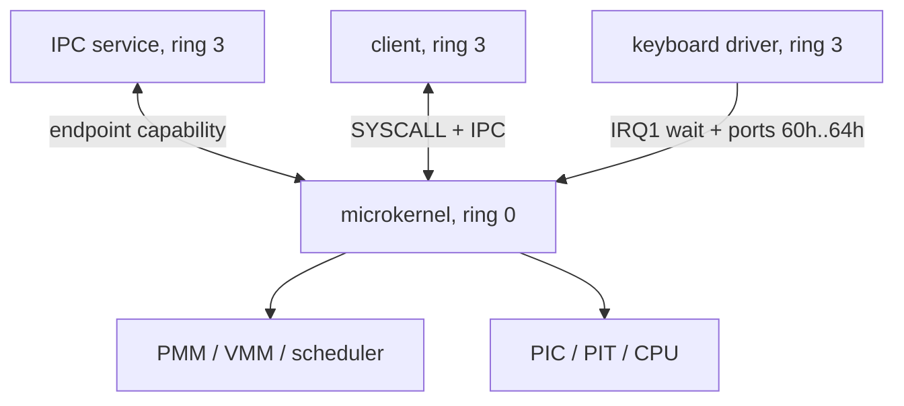

# Архитектура Varania OS

## Доверенная граница

Микроядро работает в ring 0 и содержит только механизмы, требующие привилегий:

- обработку исключений и IRQ;
- физическую и виртуальную память;
- переключение контекста и планирование;
- проверку capabilities, IPC и безопасное копирование из user space;
- минимальный VGA/debug-вывод для диагностики ранней загрузки.

Сервисы и драйверы работают в ring 3. Они не видят HHDM, таблицы ядра, TCB и
чужую память. Драйвер получает не IOPL, а два узких дескриптора: конкретный IRQ
и конкретный диапазон I/O-портов.



## Путь от BIOS до ring 3

1. BIOS загружает LBA 0 в `0x7C00`.
2. Первый этап читает 4-KiB продолжение в `0x1000`.
3. Второй этап включает A20, читает ядро в `0x60000` и получает E820.
4. В protected mode ядро копируется в физический `0x100000`; строятся PML4,
   identity map и HHDM.
5. `CR4.PAE`, `EFER.LME`, `CR0.PG|WP` включаются именно в этом порядке.
6. 64-битный trampoline загружает GDT/TSS/стек и переходит по адресу
   `0xFFFF800000100000`.
7. Ядро инициализирует IDT, PMM/VMM, slab, SYSCALL, создаёт четыре процесса и
   выходит в ring 3 через искусственный interrupt frame + `IRETQ`.

## Диск

`VOS.VHD` — raw-образ; расширение сохранено исторически.

| LBA | Размер | Содержимое | Адрес загрузки |
|---:|---:|---|---:|
| 0 | 512 Б | первый этап и `55 AA` | `0x7C00` |
| 1–8 | 4096 Б | второй этап | `0x1000` |
| 9–136 | 65536 Б | микроядро | `0x60000`, затем `0x100000` |

## Физическая память до PMM

| Диапазон | Назначение |
|---|---|
| `0x000600..0x0009FF` | записи BIOS E820 |
| `0x001000..0x001FFF` | второй этап и trampoline |
| `0x002000..0x00FFFF` | стек protected-mode этапа |
| `0x010000..0x014FFF` | начальные PML4/PDPT/PD |
| `0x060000..0x06FFFF` | временная копия ядра |
| `0x100000..0x10FFFF` | ядро |
| `0x120000..0x2DEFFF` | bootstrap-резерв старой кучи |
| `0x2DF000` | GDT64 и TSS64 |
| `0x2E0000..0x2EFFFF` | IST1 |
| `0x2F0000..0x2FFFFF` | начальный стек ядра |
| `0x3F0000..0x3F7FFF` | bitmap PMM |
| `0x500000..` | первые кадры, выдаваемые PMM |

## Виртуальная память

Начальная карта использует 2-MiB страницы:

```text
PML4[0]   -> identity 0..1 GiB       только bootstrap address space
PML4[256] -> HHDM + physical address общий supervisor-only direct map
```

`HHDM.base = 0xFFFF800000000000`, поэтому физический `0x100000` доступен ядру
как `0xFFFF800000100000`. У каждого процесса свой PML4: нижняя половина
создаётся заново, а только supervisor-ветвь `PML4[256]` разделяется с ядром.

В текущем загрузчике:

- пользовательский код: `0x400000`, read-only/user;
- пользовательский стек: `0x7FFFFFFFE000`, read-write/user;
- page tables и kernel stack каждой задачи выделяются из PMM;
- `vmm_translate_user` проверяет `P|US` на каждом уровне перед доступом к
  пользовательскому указателю.

## PMM и slab

PMM сначала считает все кадры занятыми, затем освобождает только полные страницы
в E820-регионах `type=1`, ограничивая текущую direct map одним GiB. Bitmap имеет
один бит на кадр 4 KiB.

Slab allocator делит страницу на классы 32, 64, 128, 256, 512, 1024 и 2048
байт. В каждом объекте есть 16-байтный header с классом и ссылкой free-list.
`kmalloc` выбирает минимальный класс, `kfree` возвращает объект. Таблица классов
создаётся макросом FASM `slab_class`.

## Задача и переключение контекста

TCB хранит состояние, CR3, сохранённый RSP, вершину kernel stack, IPC mailbox и
четыре типизированных capability-слота. Состояния: `RUNNABLE`, `BLOCKED_IPC`,
`BLOCKED_IRQ`, `EXITED`.

IRQ и SYSCALL приводятся к одному `Context` размером 160 байт:

```text
r15..r8, rdi, rsi, rbp, rdx, rcx, rbx, rax,
RIP, CS, RFLAGS, user RSP, user SS
```

PIT/IRQ0 сохраняет текущий RSP, выбирает следующую `RUNNABLE` задачу, меняет
CR3 и TSS.RSP0, затем восстанавливает другой Context через `IRETQ`. Квант —
10 ms; политика — простой round-robin.
Если все задачи заблокированы, ядро выполняет `STI; HLT` и повторно ищет
`RUNNABLE` задачу после IRQ, не расходуя хостовый CPU в пустом цикле.

`SYSCALL` аппаратно не меняет RSP. Entry stub сначала сохраняет user RSP,
переходит на kernel stack из TCB и вручную строит тот же Context. IF/DF
сбрасываются через `IA32_FMASK`; возврат намеренно делается безопасным `IRETQ`.

## IPC и capabilities

Handle локален процессу. Slot содержит `type`, `object`, `rights`; нулевой
handle всегда недействителен. Реализованы типы:

| Тип | Object | Права |
|---|---|---|
| endpoint | `task_index + 1` | `CAP_SEND` |
| I/O ports | `length:32 | base:16` | `CAP_READ`, `CAP_WRITE` |
| IRQ | `irq + 1` | `CAP_WAIT` |

`SYS_SEND` не принимает PID. Если получатель ждёт, значение сразу записывается
в его сохранённый Context; иначе используется mailbox глубиной один.

## Исключения

32 stubs генерируются макросом `exception_stub`, который учитывает наличие
аппаратного error code. Исключение ring 0 печатает диагностику и останавливает
CPU. Исключение ring 3 завершает только текущую задачу и запускает следующую.
Double fault использует IST1.

## Драйверные IRQ

IRQ1 имеет one-shot семантику: stub немедленно маскирует линию, сохраняет event
и посылает EOI. После обработки `SYS_IRQ_WAIT` вновь открывает ровно следующее
событие. Это не позволяет неисправному устройству создать бесконечный interrupt
storm до того, как user-драйвер подтвердил готовность.
