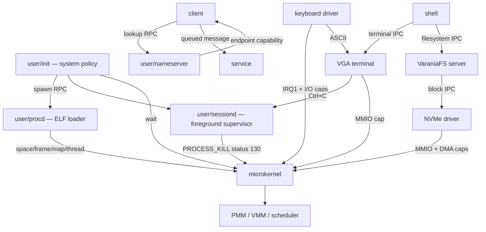
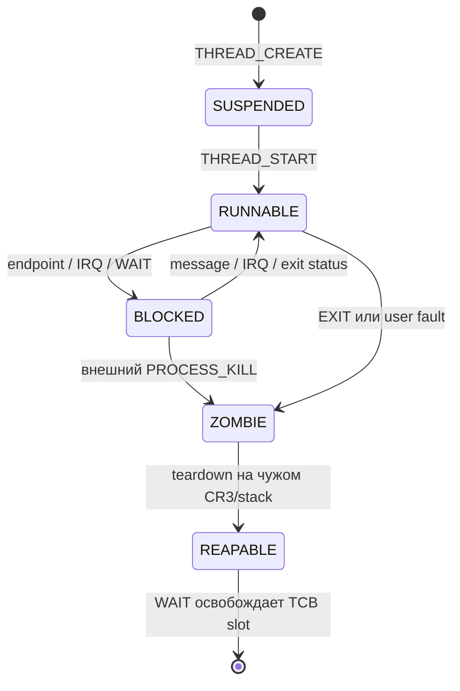

# Архитектура Varania OS

## Граница микроядра

Ring 0 содержит механизмы, которым нужны привилегии:

- exceptions/IRQ, PIC/PIT, SYSCALL и переключение контекста;
- физические frames, page tables и безопасное копирование user memory;
- TCB scheduler и lifecycle;
- kernel objects, capability tables, refcount и endpoint queues;
- минимальные IRQ/I/O и MMIO mapping после проверки capability;
- bootstrap-проверку архива и загрузку единственного `procd.elf`.

Ring 0 не принимает имя обычной программы и не разбирает её ELF при создании.
Эта политика находится в `user/procd`: он читает read-only bootfs, проверяет
ELF, создаёт space/frames/mappings/thread. `init` решает, какие процессы нужны,
а `nameserver` связывает клиентов и сервисы capability handles.



Bootstrap ELF loader всё ещё находится в kernel, потому что до первого user
процесса некому выполнить `procd`; это единственное исключение границы.
Номер старого `SYS_SPAWN` зарезервирован для совместимости ABI и возвращает
`-38`: generic kernel spawn удалён.

## Загрузка

1. BIOS загружает MBR в `0x7C00`, затем stage 2 в `0x1000`.
2. Real mode включает A20, читает kernel/initramfs ниже 1 MiB и получает E820.
3. Protected mode строит bootstrap tables, переносит kernel в `0x100000`,
   initramfs в `0x400000`, готовит GDT/TSS.
4. CPU включает `CR4.PAE`, `EFER.LME`, `CR0.PG|WP` и прыгает в higher half.
5. Kernel включает NXE, PMM/slab/IDT/SYSCALL, проверяет initramfs и bootstrap-ит
   `procd.elf` через искусственный `Context`/`IRETQ`.
6. Initramfs отображается procd по `0x80000000` как user read-only + NX;
   `BOOTFS_INFO` раскрывает только base/used size владельцу bootfs capability.
7. Procd загружает `init.elf`; дальше init создаёт систему RPC-запросами.

## Raw disk layout

`VOS.VHD` — raw image; расширение сохранено исторически.

| LBA | Размер | Содержимое | Временный → постоянный адрес |
|---:|---:|---|---|
| 0 | 512 Б | MBR и `55 AA` | `0x7C00` |
| 1–8 | 4096 Б | stage 2 | `0x1000` |
| 9–136 | 65536 Б | microkernel | `0x60000 → 0x100000` |
| 137–520 | 196608 Б | initramfs | `0x60000 → 0x400000` |

Compatibility boot занимает только первые 260 KiB. С 4 MiB в `VOS.VHD`
начинается VaraniaFS; отдельный `VARANIA.VAFS` подключается как NVMe namespace.

PMM освобождает только E820 usable pages начиная с `0x500000`, поэтому kernel,
initramfs, GDT/TSS, stacks и bitmap не могут случайно попасть в allocator.

## Виртуальная память

Bootstrap PML4 имеет identity map и supervisor-only HHDM. AddressSpace процесса
получает пустую нижнюю половину и общую запись `PML4[256]`:

```text
PML4[0]   -> identity 0..1 GiB       только bootstrap CR3
PML4[256] -> HHDM + physical         общий, supervisor-only
```

`HHDM.base = 0xFFFF800000000000`. U/S отсутствует на каждом уровне HHDM, что
проверяет `isolation_test`. User pages имеют размер 4 KiB. W^X enforced дважды:
сначала user ELF loader, затем `SPACE_MAP`, которому нельзя передать WRITE|EXEC.

User layout:

| Диапазон | Назначение |
|---|---|
| `0x00010000..0x3FFFFFFF` | ELF `PT_LOAD` и heap |
| `0x40000000..0x7FFFFFFF` | convention для user object/shared mappings |
| `0x50000000` | VGA MMIO только в address space terminal |
| `0x80000000..0x8002FFFF` | bootfs, только procd, R+NX |
| до `0x00007FFFFFF00000` | растущий user stack |

Heap начинается с выровненного максимального конца `PT_LOAD`, ограничен 4096
страницами (16 MiB). Frames создаются demand-paged вызовом `BRK`, не заранее.
Stack стартует с одной RW+NX page и растёт строго по одной соседней
странице, максимум до 16 pages.

## Kernel objects и ownership

В каждой capability slot лежат `type`, `target`, `rights`. Handle — индекс+1 в
локальной таблице; ноль недействителен.

| Тип | Target | Lifetime |
|---|---|---|
| `Endpoint` | heap object + queue | strong refcount |
| `Frame` | heap metadata + physical frame | strong refcount до map |
| `AddressSpace` | heap metadata + CR3 | strong refcount |
| `SharedMemory` | metadata + 1..64 frames | strong refcount, много mappings |
| `Process` | slot+generation token | таблица TCB + WAIT lifecycle |
| `IRQ` | irq+1 | уникальная маршрутизация |
| `I/O` | base+length | value capability |
| `MMIO` | доверенный page-aligned physical address | value capability |
| `System/Bootfs` | bootstrap token | не refcounted |

Creator получает временную ссылку; успешная вставка capability добавляет
сильную ссылку, после чего временная снимается. Capability transfer сначала
создаёт ownership очереди. Receive создаёт ownership нового handle и лишь затем
снимает queue reference. `CAP_CLOSE` и process teardown проходят через один
`capability_clear_slot`.

Особый переход ownership у frame:

```text
Frame capability -> SPACE_MAP -> leaf PTE -> AddressSpace teardown -> PMM
```

После успешного map capability потребляется, metadata Frame уничтожается, а
physical frame освобождается только вместе с mapping/address space.

Shared-memory и device MMIO используют borrowed leaf PTE:

```text
SharedMemory object -> physical frames
AddressSpace mapping -> strong ref на SharedMemory + borrowed PTE
```

Флаг `PAGE.BORROWED` занимает software-доступный бит PTE. Поэтому обычный
teardown не освобождает leaf frame. Для shared memory mapping record удерживает
объект, а последний ref возвращает его кадры PMM. Для MMIO физическая страница
принадлежит устройству и никогда не входила в PMM. Оба вида отображений NX и
живут до разрушения address space. Частичного `unmap` в текущем ABI нет.

## Терминал и файловый сервис

Интерактивная цепочка целиком находится в ring 3. Keyboard driver получает
IRQ1 и порты PS/2, переводит scan code set 1 в key/modifier event и отправляет
`TERM_KEY`. Terminal владеет одной VGA MMIO page, cursor, scrolling, echo,
line discipline, raw-key и цветным cell API. Shell получает готовую строку,
VEdit — raw keys, но ни один из них не получает VGA capability. Оба общаются с
`vafs.elf` отдельным FS-протоколом.
VFS, в свою очередь, имеет только endpoint NVMe block service и приватные
shared windows клиентов. Ядро не знает `ls`, path, extent или имя файла.
Подробный ABI описан в [FILESYSTEM.md](FILESYSTEM.md), on-disk формат — в
[VAFS.md](VAFS.md).

Nameserver дополнительно согласует ABI version. FASM-модули `/system/lib`
дают локальные wrappers, а `.vlib` manifest описывает динамически подключаемый
capability service. Это заменяет небезопасное отображение stateful DLL внутрь
каждого приложения; подробности — в [LIBRARIES.md](LIBRARIES.md).

## Дерево происхождения capabilities

Каждая занятая slot связана с `CapNode`: parent, список children, владелец и
номер slot. Создание kernel-object образует новый root, а clone, thread grant и
IPC transfer — descendant. Пока capability лежит в endpoint queue, её
происхождение хранит pinned ghost node; поэтому закрытие или `CAP_MOVE` source
не разрывает будущую цепочку receiver.

`CAP_REVOKE(handle)` сохраняет сам handle и рекурсивно закрывает все полученные
из него descendants во всех процессах и очередях. Закрытый узел без владельца
остаётся ghost, пока живы дети, и затем автоматически вырезается. Так supervisor
может отозвать делегированные права, не перебирая таблицы чужих процессов.
Если отозванный descendant ещё находился в очереди, всё сообщение атомарно
отменяется при receive: payload без части заявленных handles не доставляется.

## Endpoint IPC

Endpoint независим от TCB. Это позволяет передать сервисный канал без process
capability. Queue содержит восемь сообщений; каждое — восемь qword и две
capabilities. Пустой receive блокирует thread, полный send возвращает `-11`.
Драйверы и `libvarania` трактуют `-11` как backpressure: выполняют `YIELD` и
повторяют send. Terminal дополнительно держит ring на 64 key events, пока raw
клиент перерисовывает экран и ещё не выставил следующий `READKEY`.

Один waiting receiver удерживает endpoint ссылкой, поэтому закрытие последнего
user handle не оставляет висячий `Task.wait_endpoint`. Передача с `CAP_MOVE`
закрывает source только после commit enqueue. Reply channel передаётся явно —
ядро не хранит скрытого caller/reply состояния.

## Thread/process lifecycle

Текущая user-модель создаёт один TCB thread на AddressSpace. Разделение уже
есть в kernel ABI: `SPACE_CREATE` и `THREAD_CREATE` — разные операции, а TCB
удерживает ссылку на space. Это оставляет прямой путь к нескольким threads в
одном space после добавления синхронизации page-table mutations.



Process token равен `generation:32 | (slot+1):32`, поэтому старый handle не
указывает на новый TCB после reuse. Текущий process нельзя разрушать на его же
CR3/kernel stack: exit только меняет state; безопасная следующая задача снимает
capabilities, AddressSpace ref, page tables, frames и kernel-stack frame.

`PROCESS_KILL` требует `CAP_CONTROL`, запрещает self-kill этим интерфейсом и
снимает цель с ожидания endpoint, IRQ или другого процесса. Далее используется
тот же deferred teardown, что для `EXIT` и user fault. Пример
`user/supervisor` показывает policy отдельно от механизма: завершает
заблокированную цель, ждёт status и дважды создаёт новый worker после отказа.

Рабочая интерактивная policy находится в `sessiond`. Shell перед каждым WAIT
делегирует ему только CONTROL capability foreground child. `libvarania` делает
то же для вложенного запуска, поэтому sessiond хранит стек до восьми уровней.
Ctrl+C приходит через terminal, верхняя задача завершается status 130, а её
ожидающий родитель просыпается обычным механизмом WAIT. Ни shell, ни зависшее
приложение не обязаны исполнять обработчик сигнала.

## Scheduler и faults

IRQ и SYSCALL используют один `Context` (GPR, RIP/CS/RFLAGS/RSP/SS). PIT/IRQ0
сохраняет kernel RSP, выбирает следующий `RUNNABLE`, меняет CR3 и TSS.RSP0 и
возвращается через `IRETQ`. Политика — однопроцессорный round-robin, 10 мс.

Ring-0 fault печатает vector/error/RIP и останавливает CPU. Ring-3 #PF сначала
проверяется как допустимый stack growth; прочий fault завершает только TCB со
status `128+vector`. Освобождение выполняется отложенно на чужом address space.
