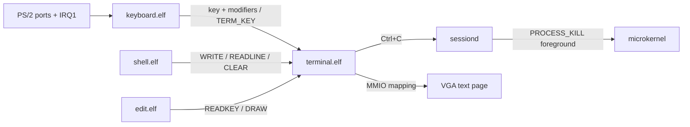

# Драйверы в пользовательском пространстве

## Модель

Драйвер Varania OS — обычная изолированная ring-3 задача. Ядро предоставляет
механизм доступа к устройству, но не реализует раскладку клавиатуры, terminal,
filesystem protocol или shell policy. При создании драйвера `procd`:

1. создаёт отдельное address space и inbox endpoint;
2. передаёт SEND-capability nameserver;
3. добавляет только разрешённые bootstrap policy device capabilities;
4. запускает процесс без IOPL и без user-доступа к HHDM.

Init сам не владеет hardware handles. Он просит запустить ELF по имени, а
точечная policy procd не позволяет выдать VGA capability произвольной программе.

## Keyboard driver

`keyboard.elf` получает handles в фиксированном порядке:

| Handle | Тип | Объект | Права |
|---:|---|---|---|
| 1 | Endpoint | inbox | `SEND|RECV` |
| 2 | Endpoint | nameserver | `SEND` |
| 3 | IRQ | IRQ1 | `WAIT` |
| 4 | I/O ports | `0x60..0x64` | `READ` |

IRQ capability имеет уникальную move-семантику при `THREAD_CREATE`: после
успешного commit handle удаляется у procd, а IRQ router указывает на token
драйвера. I/O capability копируется с attenuation.

Driver ждёт IRQ1, читает scan code из `0x60`, ведёт состояния Shift/Ctrl/Alt,
CapsLock и префикса `E0`, переводит set 1 в ASCII либо служебный key code.
Endpoint terminal он
получает через nameserver и отправляет `TERM_KEY`. Таким образом keyboard не
может рисовать на экране, а terminal не может читать PS/2 ports.

Полная endpoint queue означает backpressure `-11`, а не аварию устройства.
Keyboard уступает CPU и повторяет тот же `TERM_KEY`; это важно во время пачки
`DRAW` от редактора. Раньше этот статус завершал driver, из-за чего живое ядро
оставалось без ввода и внешне выглядело полностью зависшим.

Текущая US-таблица включает оба регистра, знаки, стрелки, Home/End,
PageUp/PageDown, Delete/Insert и F1..F10. Событие хранит key в младших 32 битах,
а модификаторы — в старших. Compose, Unicode и несколько layouts должны
появиться отдельным input service слоем.

## VGA terminal driver

`terminal.elf` получает:

| Handle | Тип | Объект | Права |
|---:|---|---|---|
| 1 | Endpoint | inbox | `SEND|RECV` |
| 2 | Endpoint | nameserver | `SEND` |
| 3 | MMIO | VGA text page `0xB8000` | `MAP|READ|WRITE` |

`SYS_MMIO_MAP` отображает страницу в `0x50000000` как `RW|NX`. Физический
адрес заключён в capability, поэтому driver выбирает только свободный virtual
address. Mapping помечен `PAGE.BORROWED`: при завершении terminal page tables
освобождаются, но device memory не возвращается PMM.

Terminal реализует 80×25 cells, scrolling, cursor в памяти, очистку, echo,
backspace, `READLINE`, raw `READKEY` и проверенный абсолютный `DRAW` до 24
цветных cells за IPC. VEdit использует raw/draw, но VGA capability не получает.
Между запросами terminal сохраняет до 64 key events в кольцевой очереди; при
переполнении удаляет самый старый autorepeat, сохраняя свежий Ctrl+C/F10.
Hardware VGA cursor ports пока не нужны. После
старта `SYS_LOG` остаётся только debugcon-интерфейсом: kernel diagnostics не
портят пользовательский экран.

## Как добавить ещё один legacy-драйвер

1. Добавить IRQ stub/IDT gate по образцу `irq_1`, если линия ещё не маршрутизируется.
2. В stub вызвать mask, `device_irq_notify`, EOI; unmask делает следующий wait.
3. Создать отдельный `src/user/name.asm` и добавить ELF в initramfs.
4. В bootstrap policy определить минимальные IRQ/I/O/MMIO capabilities.
5. Передать сервисные endpoints, а не process capabilities.
6. Зарегистрировать публичный endpoint через nameserver.
7. Добавить тест нормального события, отказа в чужом ресурсе и teardown.

Supervisor может завершить зависший драйвер по capability с `CONTROL`. Перед
рестартом он должен отозвать descendants сохранённых корней делегирования.
Полноценный рестарт hardware driver потребует device manager, который заново
маршрутизирует уникальный IRQ и выдаёт свежие handles.

## PCI, MMIO и DMA

Рабочий NVMe path уже использует следующие механизмы:

- procd сканирует PCI mechanism #1 через capability портов `CF8/CFC`;
- class/subclass/prog-if `01/08/02` выбирает NVMe function;
- 64-битный BAR probe выполняется при выключенном Memory Space decode;
- `MMIO_CREATE` заключает base+pages в capability, `MMIO_MAP` отображает весь BAR;
- `DMA_CREATE` возвращает contiguous SharedMemory и physical base;
- ring-3 драйвер создаёт Admin/I/O SQ/CQ и публикует block endpoint.

Следующие аппаратные механизмы ещё нужны:

- ECAM из ACPI MCFG вместо legacy PCI mechanism #1;
- cache attributes для MMIO mappings;
- MSI/MSI-X interrupt objects вместо polling completion;
- IOMMU domain и revoke/unmap при завершении драйвера;
- device manager вместо временной bootstrap policy в procd.

До появления IOMMU driver устройства с bus-master DMA не полностью изолирован:
само устройство способно записывать физическую память вне CPU page tables. Это
граница безопасности, а не деталь будущего API.
