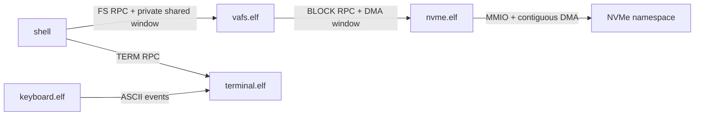

# Block service, VaraniaFS и shell

## Граница микроядра

В ring 0 нет путей, файлов и NVMe-команд. Ядро предоставляет IPC, shared memory,
MMIO/I/O capabilities и планирование. Остальные уровни — обычные процессы:



Если `vafs.elf` повреждён, он может испортить свой том, но не page tables ядра
и не MMIO другого устройства. Если shell повреждён, он не имеет capability
NVMe buffer и не может посылать block-команды.

## Discovery и capabilities

| Service ID | Процесс | Назначение |
|---:|---|---|
| 1 | `service.elf` | демонстрационный IPC |
| 2 | `terminal.elf` | текстовый вывод и строки ввода |
| 3 | `vafs.elf` | файловый протокол |
| 4 | `nvme.elf` | 4-KiB block protocol |

`procd` выдаёт NVMe-процессу только BAR, DMA allocator и nameserver. VFS
получает nameserver и `CREATE`-право, чтобы создавать отдельные shared windows;
произвольную физическую память он отобразить не может.

## Block IPC

Один запрос переносит один 4096-байтный блок. Bulk bytes лежат в 64-KiB shared
DMA window, IPC остаётся control plane.

| Операция | Request | Response |
|---|---|---|
| `BLOCK_ATTACH=1` | reply cap | status, blocks, block size, window bytes, features + shared cap |
| `BLOCK_READ=2` | block, count=1, window offset | status |
| `BLOCK_WRITE=3` | block, count=1, window offset | status |
| `BLOCK_FLUSH=4` | — | status |

Геометрия и номера блоков — `u64`. Сейчас логический блок сервиса всегда 4 KiB;
драйвер сам переводит его в один или несколько namespace LBA размером 512..4096.
`BLOCK_FEATURE_FLUSH` запрещает VFS публиковать commit до NVMe Flush.

## FS IPC

Каждый RPC передаёт `CAP_SEND` на reply endpoint. Node ID — 64-битный object ID
конкретного mounted volume; `0` является псевдонимом корня. Компонент имени
занимает `words[2..7]`: до 47 печатных байт и NUL.

### Каталоги

```text
FS_LIST=1
request:  directory, opaque cursor
entry:    status=0, next_cursor|type, name
end:      status=1

FS_LOOKUP=2
request:  parent, name
success:  status=0, object, type

FS_MKDIR=3 / FS_CREATE=4
request:  parent, name
success:  status=0, new object
```

`.` и `..` разрешает сам VFS. Shell не знает расположение B+tree и не
интерпретирует object ID.

### Shared file window

```text
FS_ATTACH=5
request:  reply cap
success:  status=0, window bytes + SharedMemory capability

FS_READ=6
request:  object, file offset, byte count, window offset
success:  status=0, bytes read

FS_WRITE=7
request:  object, file offset, byte count, window offset
success:  status=0, bytes written

FS_STAT=8
request:  object
success:  status=0, file size, type, object ID
```

Текущий `FS_WRITE` атомарно заменяет содержимое целого файла и поэтому требует
offset `0`; размер одного вызова ограничен приватным окном 256 KiB. Это честная
граница v1. Streaming/append API будет добавлен перед FASM platform layer.

VFS создаёт до четырёх окон по 64 страницы и привязывает их к неподлежающему
подделке `IpcMessage.sender`. Клиенты не делят DMA buffer NVMe и не могут
подменить данные другого клиента во время RPC.

## COW commit

`mkdir`, `touch` и `write` выполняют один порядок:

```text
new data extents
  -> new catalog leaves
  -> new internal levels
  -> BLOCK_FLUSH
  -> более старая копия superblock с generation+1
  -> BLOCK_FLUSH
```

До последней публикации новое дерево недостижимо. При ошибке сервер повторно
монтирует самое новое целое поколение, поэтому RAM-копия не расходится с диском.
Подробное размещение и CRC описаны в [VAFS.md](VAFS.md).

## Shell

| Команда | RPC |
|---|---|
| `ls` | последовательность `FS_LIST` |
| `cd` | `FS_LOOKUP`, включая `.`/`..` |
| `mkdir` | `FS_MKDIR` |
| `touch` | `FS_CREATE` |
| `cat` | `FS_LOOKUP` + последовательные `FS_READ` |
| `write FILE TEXT` | `FS_LOOKUP` + `FS_WRITE` |
| `pwd`, `clear`, `help` | локально/terminal IPC |

Line discipline принимает до 47 ASCII-байт. UTF-8 уже допустим на диске и в
host CLI, но полноценный Unicode input/rendering появится вместе с GOP/font
service.

## Проверка

`tests/test_shell.py` вводит настоящие key events через QMP, читает VGA memory,
делает `cat` существующего системного файла, создаёт `/demo/note`, записывает
`hello`, читает его обратно и останавливает VM. После остановки host CLI обязан:

- пройти `fsck --data`;
- увидеть `/demo/note` в новом поколении;
- извлечь ровно пять байт `hello`.

Так тест покрывает всю цепочку keyboard → shell → VFS → NVMe → image, а не
только debug marker отдельного процесса.
