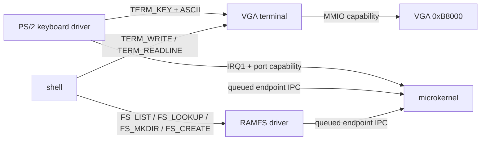

# Файловая система, RAMFS и shell

## Где проходит граница

В Varania OS нет файловых системных вызовов в ring 0. Микроядро предоставляет
процессам только endpoint IPC, память, планирование и capabilities. Каталоги,
имена, обход дерева и создание узлов реализует обычный процесс `ramfs.elf`.



Такая схема намеренно отделяет интерфейс от реализации. Будущий FAT/ext2
сервер может зарегистрировать endpoint с тем же протоколом; shell при этом не
потребует нового syscall и не получит прямой доступ к блочному устройству.

## Service discovery

Nameserver поддерживает несколько стабильных идентификаторов:

| ID | Сервис | Реализация |
|---:|---|---|
| 1 | демонстрационный IPC service | `service.elf` |
| 2 | текстовый terminal | `terminal.elf` |
| 3 | filesystem | `ramfs.elf` |

Terminal и RAMFS регистрируют ослабленную `CAP_SEND` на свой inbox. Keyboard и
shell получают endpoints через `NAMESERVER_LOOKUP`; process capabilities им не
передаются. Init запускает процессы, но не маршрутизирует каждое сообщение.

## FS IPC ABI

Каждый запрос содержит одну переданную `CAP_SEND` на reply endpoint. Драйвер
отвечает один раз и закрывает временный handle. Идентификатор узла — локальное
64-битное число конкретного filesystem server; `0` означает корень.

Имена занимают `words[2..3]`: 16 байт, не более 15 печатных ASCII-символов и
обязательный NUL. В первой версии `/` и управляющие символы запрещены.

### `FS_LIST = 1`

```text
request:  words[0]=FS_LIST, words[1]=directory, words[2]=cursor

entry:    words[0]=0
          words[1].low32=next_cursor, words[1].high32=node_type
          words[2..3]=name

end:      words[0]=1
error:    words[0]=negative errno
```

Cursor непрозрачен для клиента: начать обход нужно с `1`, затем передавать
полученный `next_cursor` до ответа `1`. В текущей RAMFS это индекс массива, но
клиент не должен на это полагаться.

### `FS_LOOKUP = 2`

```text
request:  words[0]=FS_LOOKUP, words[1]=parent, words[2..3]=name
success:  words[0]=0, words[1]=node, words[2]=node_type
```

Имена `.` и `..` разрешает сам FS driver. Родитель корня — корень.

### `FS_MKDIR = 3`, `FS_CREATE = 4`

```text
request:  words[0]=operation, words[1]=parent, words[2..3]=name
success:  words[0]=0, words[1]=new_node
```

Типы узлов: `FS_NODE_FILE=1`, `FS_NODE_DIR=2`. Значимые ошибки: `-2` узел не
найден, `-17` имя уже существует, `-20` parent не каталог, `-22` неверное имя,
`-28` таблица заполнена, `-38` операция не поддержана.

## RAMFS

`ramfs.elf` хранит до 32 узлов в собственном writable ELF segment. На старте
создаётся дерево:

```text
/
├── bin/
├── etc/
├── home/
└── README
```

Это metadata-only прототип: `mkdir` и `touch` создают дерево имён, но байты
файлов пока не читаются и не записываются. Состояние volatile и исчезает после
перезагрузки. Ядро ничего из этого дерева не видит и не может его повредить
через специальный «filesystem API» — такого API в ring 0 нет.

## Terminal и line discipline

Terminal отображает единственную физическую страницу VGA text buffer в
`0x50000000`. Capability определяет физический адрес `0xB8000`; пользователь не
может подменить его аргументом syscall. Mapping имеет `USER|RW|NX` и software
флаг `BORROWED`, поэтому teardown address space удаляет PTE, но не возвращает
device page в PMM.

Terminal владеет cursor, scrolling, echo, backspace и одной ожидающей строкой
до 15 байт. Протокол:

| Операция | Payload |
|---|---|
| `TERM_WRITE=1` | длина 0..16 и до 16 байт текста |
| `TERM_KEY=2` | один ASCII-символ от keyboard driver |
| `TERM_READLINE=3` | reply capability; ответ содержит длину и строку |
| `TERM_CLEAR=4` | очистить 80×25 cells |

`SYS_LOG` после bootstrap пишет только в debug port `0xE9`, поэтому kernel и
test markers не перемешиваются с пользовательской VGA-консолью.

## Shell

Shell — один ELF64 процесс, а не набор привилегированных kernel-команд. Сейчас
команды встроены в него, но все операции выполняются через endpoints:

| Команда | Действие |
|---|---|
| `ls` | cursor-обход текущего каталога |
| `cd DIR`, `cd ..`, `cd /` | lookup и смена текущего node |
| `mkdir DIR` | создать каталог |
| `touch FILE` | создать пустой metadata-узел файла |
| `pwd` | показать путь, который ведёт shell |
| `clear` | запросить очистку terminal |
| `help` | показать список команд |

UID/GID, mode bits, ACL, владельцы и `sudo` намеренно отсутствуют. На первом
этапе полномочием служит сам filesystem endpoint: процесс без capability не
может даже послать RAMFS запрос. Позже поверх этой границы можно добавить
отдельный policy/auth service, не усложняя ядро.

## Как заменить RAMFS дисковым сервером

1. Добавить block-device driver с минимальными IRQ/I/O/MMIO capabilities.
2. Передавать filesystem server не device process, а ослабленный block endpoint.
3. Реализовать обязательные `LIST`, `LOOKUP`, `MKDIR`, `CREATE` и те же errno.
4. Добавить операции чтения/записи; большие блоки передавать через shared memory,
   а не копировать по 16 байт control payload.
5. Зарегистрировать новый endpoint как `SERVICE_RAMFS` или ввести mount/VFS
   broker с отдельными service IDs.
6. Проверить malformed filesystem image, teardown driver-а и revoke всех
   выданных ему device capabilities.

Интерактивный тест `make test-shell` вводит команды настоящими QEMU key events,
ждёт ответы RAMFS и читает физическую VGA-память. Он подтверждает не только
debug markers, но и видимые строки `bin/`, `etc/`, `home/`, `README`, а затем
создание `/demo/note`.
