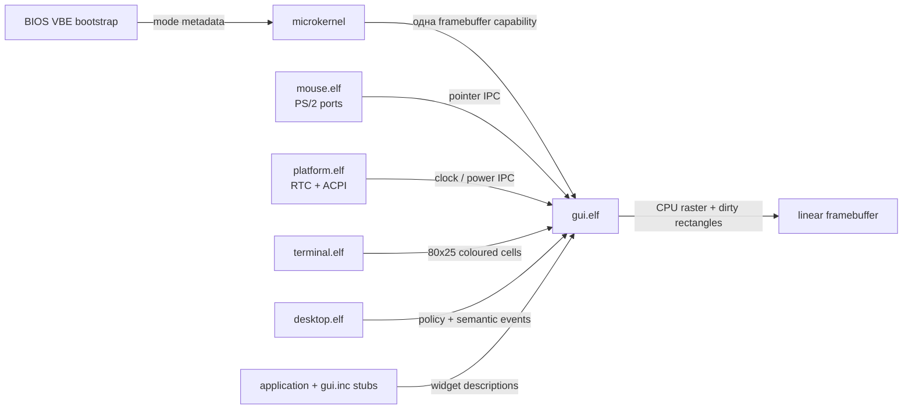

# Графическая подсистема, desktop и UI ABI

## Как запустить

После появления приглашения shell выполните:

```text
varania:/$ desktop
```

`desktop.elf` подключится к системному GUI-сервису и переключит сцену с
полноэкранной консоли на рабочий стол. Терминал открывается двойным кликом по
ярлыку `TERMINAL` или через `START → TERMINAL`. Его окно можно перетаскивать за
заголовок, свернуть, развернуть, восстановить и закрыть. Свёрнутое окно остаётся
на панели задач. `START → POWER OFF` вызывает изолированный platform service.

Внутри графического терминала работает прежний terminal ABI, поэтому команды
shell, VEdit, FASM и собранные пользователем программы не имеют отдельного
«графического» варианта. Например:

```text
varania:/$ edit /system/build/hello.asm
varania:/$ run /bin/fasm.elf /system/build/hello.asm /system/build/hello.elf
varania:/$ run /system/build/hello.elf
```

## Разделение ответственности

Графика не добавлена в микроядро. В ring 0 остались только проверка device
capability, отображение MMIO и read-only сведения о выбранном firmware mode.



- `boot.asm` выбирает видеорежим, пока BIOS ещё доступен;
- kernel выдаёт framebuffer только `gui.elf`, но не desktop и приложениям;
- `gui.elf` — video service, software compositor, window manager и единый
  renderer компонентов;
- `desktop.elf` содержит policy запуска приложений, но не рисует pixels;
- `gterm.elf` управляет жизненным циклом отдельного shell и окна;
- `terminal.elf` остаётся line discipline и моделью 80×25 cells;
- `mouse.elf` декодирует PS/2-пакеты, а `platform.elf` изолирует RTC/ACPI I/O.

Отказ desktop или gterm не разрушает kernel. При закрытии terminal window
`gterm` завершает заблокированный дочерний shell через `PROCESS_KILL`, ждёт его
teardown и только после этого закрывает окно.

## Видеорежим и программный compositor

Real-mode bootstrap перебирает VBE 2.0 modes и выбирает direct-colour linear
framebuffer с 32 bpp, шириной 800…1280 и высотой 600…800. Критерий — наибольшая
площадь; в QEMU это 1280×800. Ограничение намеренное: два CPU-side buffer такого
режима занимают около 7,8 MiB и нормально помещаются при минимальных 128 MiB
RAM, а полная перерисовка остаётся приемлемой без GPU.

`SYS_PLATFORM_INFO` возвращает только `width/height/pitch/bpp`. Физический адрес
framebuffer в ABI не раскрывается: procd уже имеет созданную kernel capability
на точный диапазон и ослабленно передаёт её GUI. Mapping всегда `RW|NX` и
`PAGE.BORROWED`, поэтому teardown удаляет page tables, но не возвращает device
memory физическому allocator.

GUI хранит wallpaper buffer и backbuffer. Сцена рисуется CPU; курсор и отдельная
terminal cell копируются dirty rectangles, а изменение layout пересобирает всю
сцену. Ни закрытый драйвер GPU, ни OpenGL/Vulkan для этого пути не нужны.
Если firmware не предоставляет подходящий VBE mode, text bootstrap продолжает
работать, а GUI завершается с диагностикой вместо обращения по случайному
адресу.

## Desktop и оконный менеджер

Системные ярлыки `TERMINAL` и `TRASH` создаёт server policy; удалить их через
публичный ABI нельзя. Ярлыки можно перетаскивать мышью. Для следующих программ
доступны операции add/move/remove до 16 записей. Двойной клик измеряется по
последовательности PS/2 pointer events и превращается в
`GUI_EVENT_LAUNCH_TERMINAL`, а не в запуск ELF внутри compositor.

Оконный менеджер пока намеренно невелик: одно terminal window, focus по мыши,
перемещение, normal/minimized/maximized state и три title-bar controls. Desktop
получает событие запуска и создаёт `/bin/gterm.elf`; gterm запускает
`/system/build/user/shell.elf`. Это сохраняет цепочку ownership и позволяет
корректно завершать окно, shell и их capabilities независимо друг от друга.

Время берётся из CMOS RTC через `platform.elf`. GUI никогда не получает I/O
ports. Выключение устроено симметрично: GUI отправляет semantic request, а
platform service с единственной WRITE-capability на ACPI PM port выполняет I/O.

## Мышь

`mouse.elf` получает только IRQ12 и порты `0x60…0x64`, включает auxiliary
device и собирает стандартные трёхбайтовые PS/2 packets. В GUI передаются
signed `dx/dy` и три кнопки; координаты, hit testing и drag state принадлежат
window manager.

В QEMU legacy `pc` IRQ12 после VBE switch доставляется не на всех host/display
backends. Поэтому текущий драйвер имеет кооперативный fallback: проверяет
`AUX_DATA` в status register и вызывает `YIELD`, когда байта нет. Он не крутится
в kernel и не блокирует другие процессы. IRQ12 capability и IDT path уже есть;
после появления kernel wait-set `IRQ + timeout` polling будет безопасно заменён.

## Централизованная библиотека компонентов

`/system/lib/gui.inc` — это набор маленьких IPC stubs. Реализация каждого
компонента находится в единственном `gui.elf`; сто приложений не получают сто
копий renderer/state machine. Nameserver выдаёт endpoint только при совместимой
версии `gui.vlib` ABI.

ABI 1 предоставляет:

| Компонент | Конструктор |
|---|---|
| button | `vlib_ui_button` |
| radio button | `vlib_ui_radio` |
| toggle | `vlib_ui_toggle` |
| checkbox | `vlib_ui_checkbox` |
| text edit | `vlib_ui_text_edit` |
| scroll view | `vlib_ui_scroll_view` |
| list view | `vlib_ui_list_view` |
| tabs | `vlib_ui_tabs` |
| panel | `vlib_ui_panel` |
| icon button | `vlib_ui_icon_button` |
| label | `vlib_ui_label` |
| image placeholder | `vlib_ui_image` |

Общий constructor ABI:

```text
RDI = application-local widget id
RSI = UI_* type                 ; convenience constructor заполняет сам
EDX = x, ECX = y
R8D = width, R9D = height
R10 = state
R11 = NUL text, GUI копирует не более 15 bytes
```

`vlib_ui_update` меняет geometry/state/text, `vlib_ui_destroy` удаляет объект.
GUI связывает widget с `sender_token`, который записало микроядро: другой
процесс не может обновить объект, просто угадав его id.
`vlib_shutdown` отправляет `GUI_CLIENT_CLOSE`: server удаляет оставшиеся
widgets и закрывает pending reply capability, поэтому нормальный повторный
запуск не расходует client slots.

`vlib_ui_wait_event` блокируется на endpoint приложения и возвращает:

```text
RAX = GUI_EVENT_ACTION или отрицательный errno
RDX = widget id
RCX = UI_* type
R8  = новое state
```

Checkbox и toggle переключают state в сервере, radio устанавливается в 1;
button, icon button, text edit, lists, scroll views и tabs дают semantic action.
В ABI 1 text edit уже имеет общий renderer/focus action, но ввод Unicode, caret,
selection и clipboard ещё должны быть вынесены из terminal keyboard path в
общий input-method service. Это явно следующая версия ABI, а не скрытая
статическая реализация в приложении.

Готовый исходник находится в `/system/templates/gui.asm`. Минимальный порядок:

```asm
call vlib_initialize
call vlib_gui_connect
; vlib_ui_panel / vlib_ui_label / vlib_ui_button
call vlib_ui_wait_event
; vlib_ui_destroy для каждого созданного компонента
call vlib_shutdown
```

Пока shell line discipline ограничена 47 байтами, для self-hosted проверки есть
короткий entry без дублирования исходника:

```text
varania:/bin$ run fasm.elf /system/ui.asm /system/build/g.elf
```

Одновременно хранятся до 32 widgets и восемь UI clients. Это ранние понятные
лимиты ABI 1, а не формат данных на диске или архитектурное ограничение.

## Обои и assets

Исходный PNG лежит в
`/system/assets/wallpapers/varania-default.png`, а compositor читает заранее
подготовленный 1280×800 BGRA-файл без decoder внутри доверенного пути. Обои
созданы специально для Varania OS: спокойные тёмно-синие волны, тёплый центр,
низкий контраст под окнами и свободные зоны под ярлыки/панель.

`vlib_gui_set_wallpaper(1)` перечитывает стандартный asset,
`vlib_gui_set_wallpaper(2)` включает детерминированный procedural gradient.
В будущем decoder/thumbnailer следует оставить отдельным user-space сервисом,
а compositor принимать проверенный shared pixel surface.

## Проверка

```bash
make test-gui
```

Тест загружает ОС с 128 MiB RAM, проверяет точные 1280×800 и непустую
многоцветную сцену, управляет PS/2 мышью через QMP, открывает terminal и
проверяет maximize, restore, minimize, taskbar restore и close. Для сохранения
кадра:

```bash
VARANIA_GUI_SCREENSHOT=/tmp/varania-desktop.ppm make test-gui
```

Полный `make test` дополнительно доказывает, что графическое зеркало не сломало
headless terminal, shell, VEdit, FASM, process lifecycle и VaraniaFS.

## Текущие границы

- BIOS/VBE — compatibility bootstrap; UEFI GOP ещё нужен для современного
  bare-metal пути;
- compositor использует один CPU и одно terminal window; нет GPU acceleration,
  alpha composition нескольких произвольных application windows и vsync;
- PS/2 — compatibility input; USB/xHCI HID и общий Unicode input service ещё не
  реализованы;
- widget renderer уже общий и событийный, но сложные text/list models и
  accessibility protocol должны появиться в следующих версиях GUI ABI;
- framebuffer capability защищает CPU-доступ, но полноценная графическая
  изоляция ускорителя в будущем потребует IOMMU и отдельного GPU driver.

Эти ограничения оставлены видимыми: текущий этап — рабочий учебный
микроядерный desktop на стандартном firmware framebuffer, а не имитация полного
современного GPU stack.
