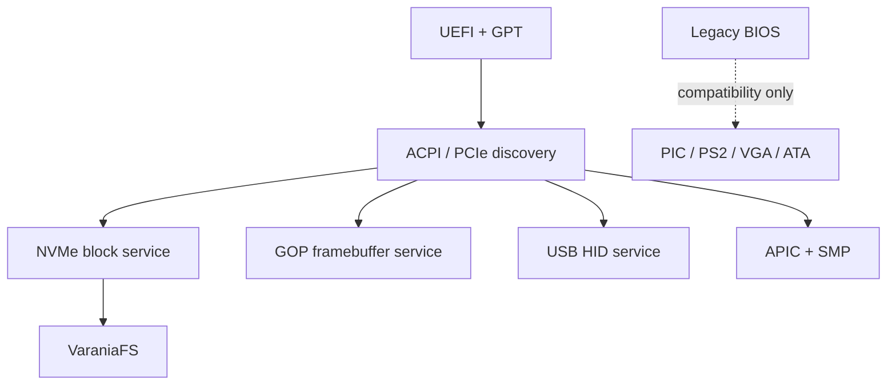

# Целевая аппаратная платформа

Varania OS — учебная ОС для современного 64-битного компьютера. Слово
«учебная» означает прозрачные инварианты, понятный FASM и подробные
русские комментарии. Оно не означает выбор аппаратуры 1990-х годов.

## Базовый профиль

| Часть | Минимум для теста | Основной интерфейс |
|---|---:|---|
| CPU | x86-64, NX, SSE2, local APIC | UEFI/ACPI, SMP |
| RAM | 128 MiB | 512 MiB и больше |
| Системный диск | 1 GiB | NVMe, 64-битные LBA |
| Экран | UEFI GOP framebuffer | нативное разрешение |
| Ввод | USB HID | отдельный input service |
| Таблица разделов | GPT | ESP + VaraniaFS |

128 MiB и 1 GiB — не размеры внутренних полей. Это лишь маленькая конфигурация
для быстрого CI. Размеры памяти, физические адреса, LBA, номера блоков и
размеры файлов в новом ABI 64-битные.

## Основной и compatibility пути

Работающий BIOS/PIC/PIT/VGA/PS2 код сохраняется как наглядный compatibility backend и
как переходный bootstrap. Новые подсистемы не должны зависеть от него. Основная
QEMU-машина после миграции: `q35`, OVMF, NVMe, USB, несколько vCPU.

## Память и CPU

- PMM получает UEFI memory map и не имеет встроенного лимита 1 GiB.
- HHDM строится по фактическому physical address width CPU.
- ACPI MADT описывает CPU и I/O APIC; старый PIC отключается.
- Каждый CPU имеет свои kernel stack, scheduler state и TSS; общие объекты защищены SMP-locks.
- Поток и процесс — разные объекты; один address space может иметь несколько threads.

## Накопители

Файловая система общается с абстрактным block service. Свойства возвращает
драйвер: logical/physical block size, число блоков, volatile write cache, flush/FUA,
discard, rotational/non-rotational. VaraniaFS не определяет SSD по имени устройства.

NVMe — основной backend. AHCI и USB Mass Storage могут реализовать тот же протокол.
PIO ATA остаётся только наглядным fallback без обещаний по производительности.

## Реализовано сейчас

- минимальная конфигурация QEMU действительно использует 128 MiB RAM;
- системный sparse-том имеет размер 1 GiB и 64-битную геометрию;
- `procd` находит PCI function NVMe по class/subclass/prog-if и создаёт узкую
  MMIO capability на 64-битный BAR;
- ring-3 `nvme.elf` создаёт admin/I/O queues в contiguous DMA memory, выполняет
  Identify Namespace, Read, Write и Flush;
- ring-3 `vafs.elf` монтирует постоянный том поверх block IPC;
- тест обязан пройти DMA write/read-back и восстановить исходный блок.

## Следующий переход платформы

Firmware/console/input и планировщик всё ещё используют compatibility path.
Порядок миграции зафиксирован так:

1. `q35 + OVMF`, GPT и отдельный ESP;
2. UEFI memory map и GOP framebuffer handoff;
3. ACPI RSDP/XSDT, MADT, local APIC и I/O APIC;
4. per-CPU TSS/stacks/run queue и SMP-safe object locks;
5. xHCI + USB HID keyboard;
6. отключение BIOS/PIC/PIT/VGA/PS2 из основного профиля.

Compatibility backend удаляется только после эквивалентного автоматического
теста современного пути.
